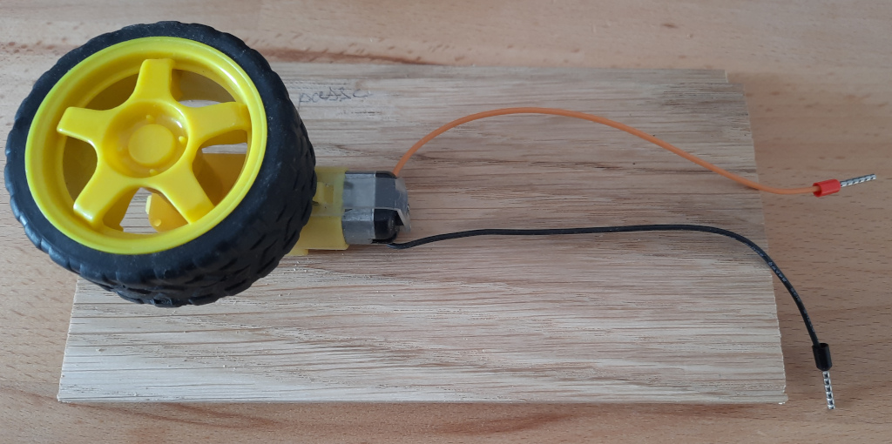

# Viticognac

## Arduino Nano et controleur de moteur(s) L298N (pont H)

### Arduino Nano
https://store.arduino.cc/collections/boards-modules/products/arduino-nano

À base de ATmega328

connections (entréé/sorties): https://content.arduino.cc/assets/Pinout-NANO_latest.png

### Moteur de test

### L298N

## Sketchbook

Héberge les sketchs permettant de programmer l'Arduino.

### testMoteur

pour tester le bon fonctionnement alim + moteur + L298N

[testMoteur.ino](/sketchbook/testMoteur/testMoteur.ino)
